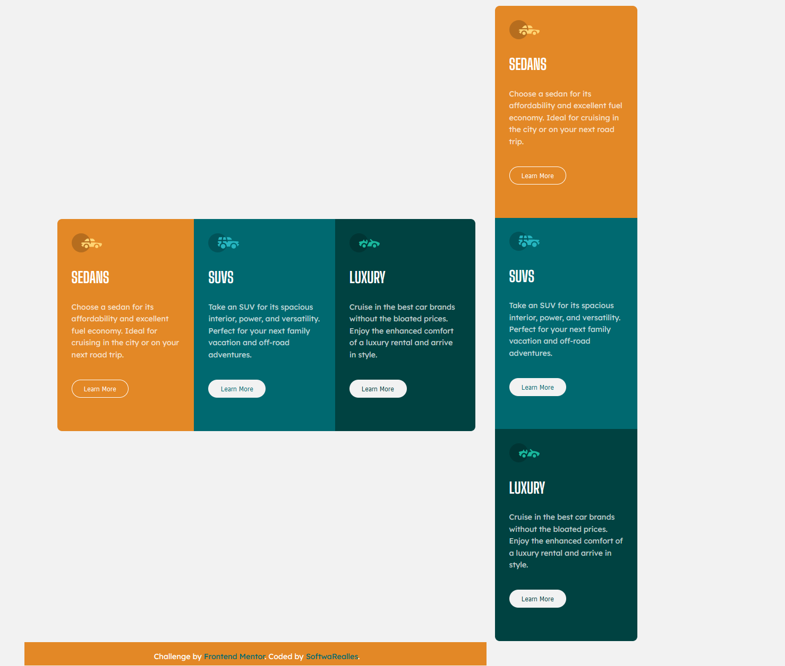

# Frontend Mentor - Stats preview card component solution

This is a solution to the [Stats preview card component challenge on Frontend Mentor](https://www.frontendmentor.io/challenges/3column-preview-card-component-pH92eAR2-). Frontend Mentor challenges help you improve your coding skills by building realistic projects. 

## Table of contents

- [Overview](#overview)
  - [The challenge](#the-challenge)
  - [Screenshot](#screenshot)
- [My process](#my-process)
  - [Built with](#built-with)
  - [What I learned](#what-i-learned)
  - [Continued development](#continued-development)
  - [Useful resources](#useful-resources)
- [Author](#author)
- [Acknowledgments](#acknowledgments)

## Overview

### The challenge

Users should be able to:

- View the optimal layout depending on their device's screen size

### Screenshot


## My process

### Built with

- Semantic HTML5 markup
- CSS custom properties
- Flexbox
- SCSS

### What I learned

work with sequential elements.

```css
.card:nth-child(1){
	background: $card1;
	border-radius: 10px 0 0 10px;
}
.card:nth-child(2){
	background: $card2;
	color: $card2;
}
.card:nth-child(3){
	background: $card3;
	border-radius: 0 10px 10px 0;
	color: $card3;
}
```

## Author

- Frontend Mentor - [@SoftwaRealles](https://www.frontendmentor.io/profile/SoftwaRealles)
- Facebook - [@SoftwaRealles](https://www.facebook.com/softwarealles)
- Github - [@SoftwaRealles](https://github.com/SoftwaRealles)

## Acknowledgments

Agradecer a Front-end Mentor por disponibilizar esse conteúdo para poder práticar e desenvolver skills de Front-Fend.
