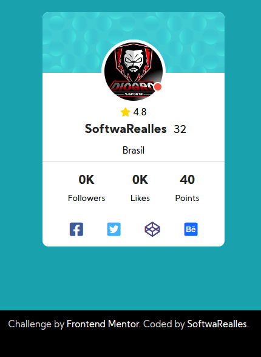

# Frontend Mentor - Profile card component solution

This is a solution to the [Profile card component challenge on Frontend Mentor](https://www.frontendmentor.io/challenges/profile-card-component-cfArpWshJ). Frontend Mentor challenges help you improve your coding skills by building realistic projects. 

- [Overview](#overview)
  - [The challenge](#the-challenge)
  - [Screenshot](#screenshot)
- [My process](#my-process)
  - [Built with](#built-with)
  - [What I learned](#what-i-learned)
  - [Continued development](#continued-development)
  - [Useful resources](#useful-resources)
- [Author](#author)
- [Acknowledgments](#acknowledgments)

## Overview

### The challenge

Users should be able to:

- View the optimal layout depending on their device's screen size

### Screenshot


## My process

### Built with

- Semantic HTML5 markup
- CSS custom properties
- Flexbox
- SCSS

### What I learned

I liked working with hours of operation open from Monday to Friday from 8:00 am to 6:00 pm.

```css
[data-weekend]::after{
  content: '';
  display: inline-block;
  width: 12px;
  height: 12px;
  background: $closed;
  border-radius: 50%;
  margin-left: 5px;
  border: 2px solid $white;
	position: absolute;
	top: 70px;
	right: 5px;
}
[data-weekend].open::after{
  background: $green;
}
```

## Author

- Frontend Mentor - [@SoftwaRealles](https://www.frontendmentor.io/profile/SoftwaRealles)
- Facebook - [@SoftwaRealles](https://www.facebook.com/softwarealles)
- Github - [@SoftwaRealles](https://github.com/SoftwaRealles)

## Acknowledgments

Agradecer a Front-end Mentor por disponibilizar esse conteúdo para poder práticar e desenvolver skills de Front-Fend.
