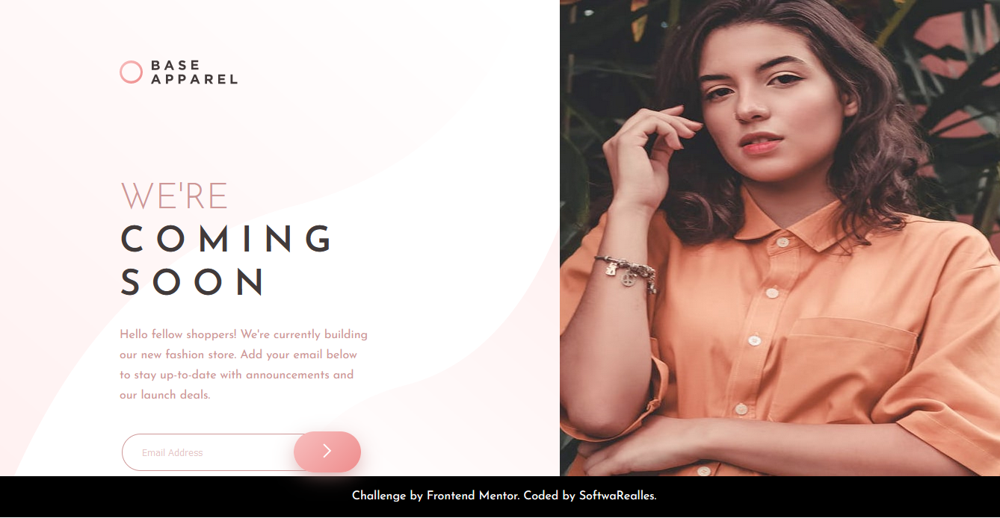

# Frontend Mentor - Base Apparel coming soon page solution

This is a solution to the [Base Apparel coming soon page challenge on Frontend Mentor](https://www.frontendmentor.io/challenges/base-apparel-coming-soon-page-5d46b47f8db8a7063f9331a0). Frontend Mentor challenges help you improve your coding skills by building realistic projects. 

## Table of contents

- [Overview](#overview)
  - [The challenge](#the-challenge)
  - [Screenshot](#screenshot)
  - [Links](#links)
- [My process](#my-process)
  - [Built with](#built-with)
  - [What I learned](#what-i-learned)
  - [Continued development](#continued-development)
  - [Useful resources](#useful-resources)
- [Author](#author)
- [Acknowledgments](#acknowledgments)

## Overview

### The challenge

Users should be able to:

- View the optimal layout for the site depending on their device's screen size
- See hover states for all interactive elements on the page
- Receive an error message when the `form` is submitted if:
  - The `input` field is empty
  - The email address is not formatted correctly

### Screenshot




### Links

- Solution URL: [Add solution URL here](https://github.com/SoftwaRealles/frontendmentor/tree/master/06-hero)
- Live Site URL: [Add live site URL here](https://front-delivery-06.surge.sh/)

## My process

### Built with

- Semantic HTML5 markup
- CSS custom properties
- Flexbox
- CSS Grid

### What I learned
sempre deixar footer embaixo
```css
body{
	display: grid;
	grid-template-rows: 1fr 50px;
	font-family: $fontJosefin;
}
```

## Author

- Frontend Mentor - [@SoftwaRealles](https://www.frontendmentor.io/profile/SoftwaRealles)
- Facebook - [@SoftwaRealles](https://www.facebook.com/softwarealles)
- Github - [@SoftwaRealles](https://github.com/SoftwaRealles)

## Acknowledgments

Agradecer a Front-end Mentor por disponibilizar esse conteúdo para poder práticar e desenvolver skills de Front-Fend.
