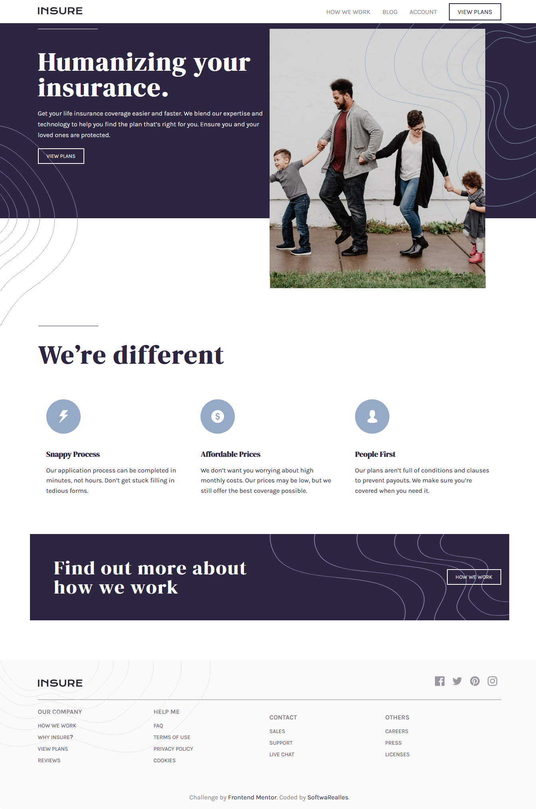
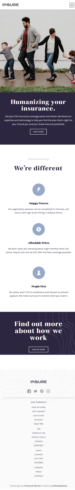

# Frontend Mentor - Insure landing page solution

This is a solution to the [Insure landing page challenge on Frontend Mentor](https://www.frontendmentor.io/challenges/insure-landing-page-uTU68JV8). Frontend Mentor challenges help you improve your coding skills by building realistic projects. 

## Table of contents

- [Overview](#overview)
  - [The challenge](#the-challenge)
  - [Screenshot](#screenshot)
  - [Links](#links)
- [My process](#my-process)
  - [Built with](#built-with)
  - [What I learned](#what-i-learned)
  - [Continued development](#continued-development)
  - [Useful resources](#useful-resources)
- [Author](#author)
- [Acknowledgments](#acknowledgments)

## Overview

### The challenge

Users should be able to:

- View the optimal layout for the site depending on their device's screen size
- See hover states for all interactive elements on the page

### Screenshot




### Links

- Solution URL: [My solutionGithub](https://github.com/SoftwaRealles/frontendmentor/tree/master/07-landing-page)
- Live Site URL: [My solutionlive](https://front-delivery-07.surge.sh/)

## My process

### Built with

- Semantic HTML5 markup
- CSS custom properties
- Flexbox
- CSS Grid

### What I learned
Aplicar imagens como enfeites

```css
.header::before{
	content: '';
	background: url('../images/bg-pattern-intro-right-desktop.svg') no-repeat top right;
	position: absolute;
	top: 0;
	right: 0;
	width: 86%;
	height: 100%;
	z-index: 3;
}
```
## Author

- Frontend Mentor - [@SoftwaRealles](https://www.frontendmentor.io/profile/SoftwaRealles)
- Facebook - [@SoftwaRealles](https://www.facebook.com/softwarealles)
- Github - [@SoftwaRealles](https://github.com/SoftwaRealles)

## Acknowledgments

Agradecer a Front-end Mentor por disponibilizar esse conteúdo para poder práticar e desenvolver skills de Front-Fend.
